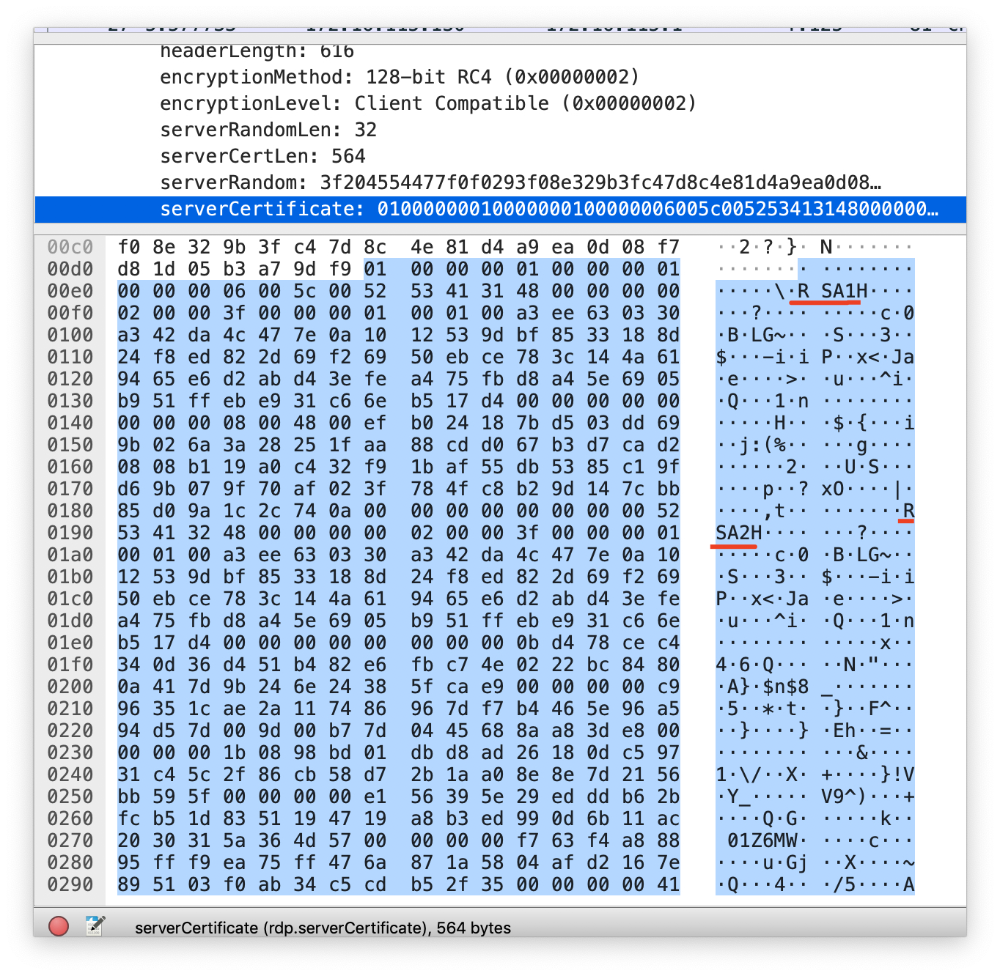
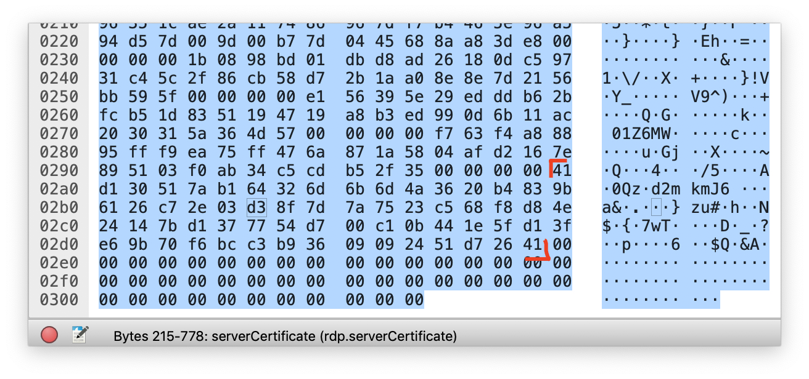

# Insecure RDP

> aka super-guess challenge

## Attempt 1

Old-rdp uses rc4 128 bit encryption for secure-connection. To make rc4 encryption key rdp uses RSA asymmetric crypto, btw the key is really short(512 bit).

At the first time, I mistaken the bytes are right order.
I put that number(N) and search on factordb. (http://factordb.com/index.php?query=8585773518239202618014259252265007041474576494007326305566936231179558082498454385604139747248680116141231666404283485452921757852460000935905449875937236)
Sadly it could not be a (N) since this is not a (prime1 * prime2) form.

Yes, I notice that the bytes are reverse order. (http://factordb.com/index.php?query=11108191436132586895020456675719608627041223049898764263726511071041880035545059834370244436455550875653187155250844471535388827581310104544771906189127331)
But I can't find its private key.....

## Attempt 2

I looked again the pcap file slowly. I figure out that `serverCertificate` has a little difference between regular rdp packets.



The normal rdp packets do not contains `RSA2` part. Yes, this is the form of LSA secret. :(

```
C:\>LsaSecretReader.exe L$HYDRAENCKEY_28ada6da-d622-11d1-9cb9-00c04fb16e75
======================================================
= LSA secret reader by Passcape Software             =
= Visit http://www.passcape.com for more information =
======================================================

0000: 52 53 41 32 48 00 00 00 00 02 00 00 3F 00 00 00
0010: 01 00 01 00 ED F1 18 33 9E 6C F3 08 88 CA D5 2A
0020: 43 92 15 47 E3 CE 96 2E B3 63 97 85 DC 24 33 58
0030: 8A 8C 89 E2 16 06 C2 39 40 95 D8 C4 81 60 45 81
0040: 8E 00 7D 26 17 8F F5 C7 9D 7A 46 1B 03 83 6B DF
0050: 66 60 DA BD 00 00 00 00 00 00 00 00 C5 2E C2 9A
0060: CD 5C 85 91 09 37 C7 45 A8 76 C3 9F E8 AD D6 D6
0070: 21 2B 44 FF 9A 5B 99 70 62 88 24 ED 00 00 00 00
0080: 09 E9 24 CA 37 F3 88 DE B2 E5 02 BF F7 4B E9 C2
0090: 0C 28 D3 D8 40 72 6F 49 D2 CC E6 D3 62 2D F3 CC
00A0: 00 00 00 00 CD 0B 24 05 48 0A CA A0 F6 54 5B 32
00B0: A2 0F 3F AB EC 2A DF C9 BD D7 FB BE C0 D1 E6 CA
00C0: 25 5A C5 E3 00 00 00 00 B9 D7 FD 7F EB AB EF D5
00D0: 57 10 F0 6C F5 76 9B 79 9E 91 E3 D4 7F C7 74 71
00E0: C1 C7 2E 67 B3 DE 49 17 00 00 00 00 3B 44 55 4B
00F0: 46 21 AC 8F 38 A6 A8 A5 D7 06 31 0D 2A DA D1 D6
0100: E4 2C ED D9 4F A4 D3 6D 35 E4 54 06 00 00 00 00
0110: 81 E9 5D D8 37 C1 AD C5 A6 82 02 CF A7 D0 1D 9F
0120: AE 10 C9 9F 69 0A CD C4 58 BD 76 DE 3C DC 9D 7F
0130: 1E 31 D1 C0 AD 2F A8 9B 84 33 73 5C 5D CE 29 D7
0140: 12 60 41 D6 2C AD 3F 70 A7 24 8C 60 E9 48 82 39
0150: 00 00 00 00 00 00 00 00 00 00 00 00 00 00 00 00
0160: 00 00 00 00 00 00 00 00 00 00 00 00 00 00 00 00
0170: 00 00 00 00 00 00 00 00 00 00 00 00

This gives public key of:
52 53 41 31 48 00 00 00 00 02 00 00 3f 00 00 00
01 00 01 00 ed f1 18 33 9e 6c f3 08 88 ca d5 2a
43 92 15 47 e3 ce 96 2e b3 63 97 85 dc 24 33 58
8a 8c 89 e2 16 06 c2 39 40 95 d8 c4 81 60 45 81
8e 00 7d 26 17 8f f5 c7 9d 7a 46 1b 03 83 6b df
66 60 da bd 00 00 00 00 00 00 00 00

..and private key of
81 e9 5d d8 37 c1 ad c5 a6 82 02 cf a7 d0 1d 9f
ae 10 c9 9f 69 0a cd c4 58 bd 76 de 3c dc 9d 7f
1e 31 d1 c0 ad 2f a8 9b 84 33 73 5c 5d ce 29 d7
12 60 41 d6 2c ad 3f 70 a7 24 8c 60 e9 48 82 39
```



```shell
root@junoim-deploy:~/0ctf/RDP-Replay# cat /tmp/aaa.txt
aa,5253413148000000000200003f00000001000100a3ee630330a342da4c477e0a1012539dbf8533188d24f8ed822d69f26950ebce783c144a619465e6d2abd43efea475fbd8a45e6905b951ffebe931c66eb517d40000000000000000,41D130517AB164326D6B6D4A3620B4839B6126C72E03D38F7D7A7523C568F8D84E24147BD1377754D700C10B441E5FD13FE69B70F6BCC3B93609092451D72641
root@junoim-deploy:~/0ctf/RDP-Replay# replay/rdp_replay -r /tmp/out.pcap -l /tmp/aaa.txt --save_clipboard --show_keys > output3
root@junoim-deploy:~/0ctf/RDP-Replay# cat output3
Processed 1 private keys
1440x900x8
We have the private key for this server: aa
error: no keyboard mapping available!
Warning xf_GetWindowProperty (142): Property 314 does not exist
<unknown>rnotepad
flag{}<KP_4>779a099914144e6c512b0581
```
